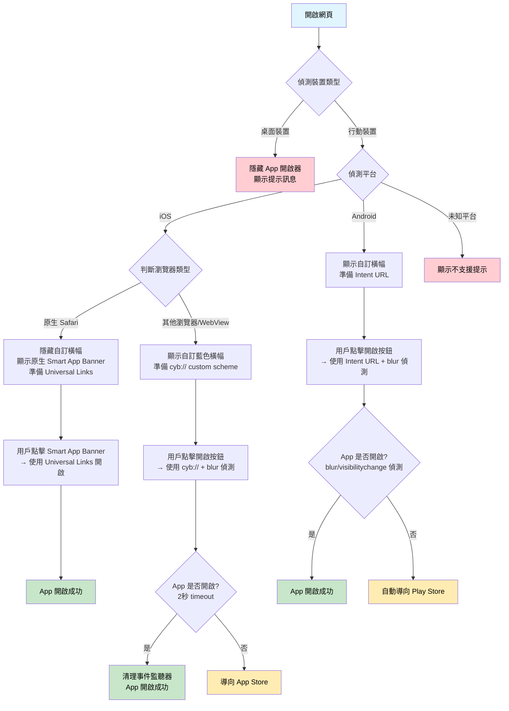

# App 開啟器 - Smart App Banner

這是一個純前端的智慧型 App 開啟器，用於在網頁上自動偵測並開啟 App 或導向 App Store / Play Store。

## 🎯 功能特點

- ✅ 自動偵測 iOS 和 Android 平台
- ✅ 支援 Universal Links 和 App Links
- ✅ 支援 Custom URL Schemes (`cyb://`)
- ✅ iOS Safari 原生 Smart App Banner 支援
- ✅ 智慧瀏覽器偵測（Safari vs 其他 iOS 瀏覽器 vs in-app webview）
- ✅ 自動降級處理（導向商店）
- ✅ 智慧橫幅顯示（iOS Safari 自動隱藏）
- ✅ **Mobile 裝置偵測**（桌面版自動隱藏 App 開啟器）
- ✅ 防重複點擊和記憶體洩漏保護
- ✅ 純前端實作，無需後端

## 🎨 UI 設計

- **智慧橫幅顯示**：
  - iOS Safari：隱藏自訂橫幅，讓原生 Smart App Banner 顯示
  - 其他手機瀏覽器：顯示藍色漸層橫幅，包含 App 圖示、"使用 APP 瀏覽" 文字和開啟按鈕
  - 桌面瀏覽器：完全隱藏橫幅，顯示「請使用手機瀏覽此頁面」提示
- **內容區域**：淺灰色背景 (#f9f9f9)，深灰色 SVG X 圖案（4px 線條），中央顯示「網頁內容」
- **載入狀態**：按鈕點擊時顯示 loading 動畫，智慧偵測 App 開啟狀態
- **響應式設計**：適配手機和桌面裝置

## 🔧 技術實作

### 平台判斷流程圖



### iOS 邏輯
- **原生 Safari**：
  - 隱藏自訂橫幅，讓原生 Smart App Banner 顯示
  - 直接使用 Universal Links 開啟 App
- **其他瀏覽器/WebView**：
  - 顯示自訂藍色橫幅
  - 使用 `cyb://` custom scheme + blur/visibilitychange 事件偵測（2 秒 timeout）
  - 完整的事件清理機制，避免記憶體洩漏

### Android 邏輯
- 使用 **Android Intent URL** 方式，包含完整的 fallback 機制
- 格式：`intent://domain#Intent;scheme=https;package=packageName;S.browser_fallback_url=playStoreUrl;end`
- 支援 blur/visibilitychange 事件偵測，確保正確的 fallback 行為
- 自動導向 Play Store（如果 App 未安裝）

### 瀏覽器偵測
支援廣泛的瀏覽器和 in-app webview 偵測：
- **主流瀏覽器**：Chrome、Firefox、Edge、Safari 等
- **社交媒體 App**：Line、Facebook、Instagram、Twitter、WeChat、Messenger
- **其他 App**：TikTok、LinkedIn、Pinterest、Snapchat、WhatsApp、Telegram、Viber、Skype

### Mobile 裝置偵測
智慧偵測是否為行動裝置：
- **User Agent 檢查**：Android、iOS、BlackBerry 等
- **觸控支援檢查**：`ontouchstart` 和 `maxTouchPoints`
- **螢幕尺寸檢查**：寬度 ≤ 768px
- **桌面版行為**：完全隱藏 App 開啟器，顯示友善提示

### 設定檔案
所有 App 相關設定都在 `app-opener.js` 的 constructor 中：

```javascript
universalLink: 'https://demo.cyberbiz.co/'
iosScheme: 'cyb://'                                    // iOS custom scheme
appStoreUrl: 'https://apps.apple.com/app/id1491696181'
playStoreUrl: 'https://play.google.com/store/apps/details?id=com.funbox.omoapp'
androidPackage: 'co.cyberbiz.demo'                   // Android package name (測試用)
timeout: 2000                                         // 2 秒 timeout
buttonClickDelay: 100                                 // 按鈕點擊延遲
autoOpenDelay: 500                                    // 自動開啟延遲
```

## 📱 支援平台

### iOS
- ✅ Safari（原生 Smart App Banner）
- ✅ Chrome、Firefox、Edge、Brave 等第三方瀏覽器
- ✅ LINE、Facebook、Instagram、TikTok、WhatsApp 等 in-app webview

### Android
- ✅ Chrome、Firefox、Samsung Internet 等所有瀏覽器
- ✅ 各種 in-app webview
- ✅ Intent URL 支援，更穩定的 App 開啟機制

## 📝 檔案結構

```
launch_app_from_web/
├── index.html          # 主頁面（智慧橫幅 + 內容區域）
├── app-opener.js       # 核心邏輯與智慧判斷
└── README.md          # 說明文件
```

## ⚠️ 注意事項

1. **智慧橫幅顯示**：iOS Safari 隱藏自訂橫幅，讓原生 Smart App Banner 顯示
2. **SVG X 圖案**：使用 SVG 繪製精確的對角線（左上到右下，右上到左下）
3. **Custom URL Scheme**：iOS 在沒有安裝 App 時可能會顯示錯誤訊息（非 Safari 瀏覽器）
4. **Android Intent URL**：使用標準 Intent URL 格式，比 custom scheme 更穩定
5. **Universal Links**：需要 HTTPS 和正確的 apple-app-site-association 設定
6. **瀏覽器偵測**：涵蓋主流 in-app webview，但新瀏覽器可能需要更新
7. **Smart App Banner 關閉**：用戶關閉後無法重新顯示，需依賴自訂橫幅
8. **防重複點擊**：內建防重複點擊機制，避免 App 無限開啟問題
9. **記憶體管理**：完整的事件清理機制，避免記憶體洩漏

## 🔧 進階功能

### 自動開啟
在 URL 中加入 `?autoOpen=true` 可自動開啟 App：
- 支援平台檢查（只在 iOS/Android 上執行）
- 支援 Bot 偵測（避免爬蟲觸發）
- 範例：`https://example.com/?autoOpen=true`

### 錯誤處理
- 不支援平台：顯示友善的 UI 提示而非 alert
- 網路錯誤：自動 fallback 到商店
- 按鈕狀態：智慧偵測 App 開啟狀態並同步按鈕

## 🔄 未來改進

- [ ] 加入使用分析追蹤
- [ ] A/B 測試不同的 UI 設計
- [ ] 支援更多 App 的 URL scheme
- [ ] 加入觸覺反饋和音效
- [ ] 效能優化和 PWA 支援

## 🚀 測試版 → 正式版調整

### 要做的事：改成動態 URL（使用當前頁面網址）

#### 1. 修改 app-opener.js
```javascript
// 找到這行（第 10 行左右）
universalLink: config.universalLink || 'https://demo.cyberbiz.co/zh-TW/blogs/%E8%89%AF%E5%93%81%E7%94%9F%E6%B4%BB%E7%A0%94%E7%A9%B6%E6%89%80',

// 改成
universalLink: config.universalLink || window.location.href,
```

#### 2. 修改 Smart App Banner 設定
```javascript
// 找到這行（第 220 行左右）
const testUrl = 'https://demo.cyberbiz.co/zh-TW/blogs/%E8%89%AF%E5%93%81%E7%94%9F%E6%B4%BB%E7%A0%94%E7%A9%B6%E6%89%80';

// 改成
const currentUrl = window.location.href;
```

#### 3. 上線前確認
- [ ] App 端 Universal Link 設定完成
- [ ] `apple-app-site-association` 檔案已部署
- [ ] 測試不同頁面的 App 開啟行為
- [ ] 確認 App 未安裝時的 fallback 正常

就這樣，兩個地方改一下就搞定了！